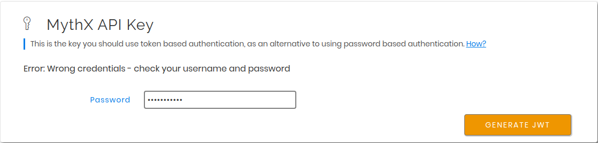
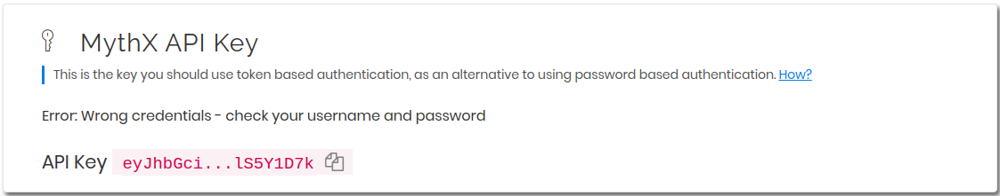
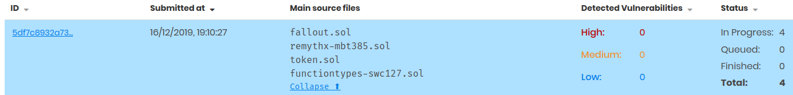

=====
Usage
=====

Authentication
--------------

Basic MythX services are free of charge.
No payment information or email address are required and you can start
using MythX right away by signing up for an account `here <https://dashboard.mythx.io/#/registration>`_.
Once set up, head over to the `dashboard <https://dashboard.mythx.io/>`_.
In the *Tools* section various means of authentication are presented.

Using API Tokens
~~~~~~~~~~~~~~~~

This is the recommended way of authenticating with the MythX smart contract
analysis API. In the *Tools* section there is an elements labeled "MythX API Key".
To generate a new API key, the account password must be entered:

On successful authentication a new JWT token is generated, which can be
used for further authentication by API clients. It will only be shown once
and can be copied using the icon on the right of the truncated secret string.
If the token is lost, a new one can be generated again in the same way as
explained above.

This key can be passed to the MythX CLI either as an environment variable
names :code:`MYTHX_API_KEY` or as an explicit parameter
:code:`--api-key`.
For security reasons it is recommended to always pass the token through an
environment variable, e.g. defined in the settings of a Continuous Integration (CI)
server or a shell script that can be sourced from.

Using Address and Password (not recommended)
~~~~~~~~~~~~~~~~~~~~~~~~~~~~~~~~~~~~~~~~~~~~

Alternatively, username and password can be used for authentication.
This is not recommended as a potential attacker can get access to the MythX
account as a whole if these credentials are leaked.
For compatibility reasons this functionality has been included, however it
is to be expected that this API feature will be disabled in the future.

The username corresponds to the Ethereum address the MythX account has been
registered under, and the password is the one that has been set during
registration, or separately in the MythX dashboard.
Both can be passed either explicitly using the :code:`--username`
and :code:`--password` option respectively, or by setting the
:code:`MYTHX_USERNAME` and :code:`MYTHX_PASSWORD` environment variables.

Note that if username and password, as well as an API token are given,
the API token will always take precedence and no login action using
the provided credentials will be performed.

The Analysis Functionality
--------------------------

Submitting Analyses
~~~~~~~~~~~~~~~~~~~

.. code-block:: console

    $ mythx analyze --help
    Usage: mythx analyze [OPTIONS] [TARGET]...

      Analyze the given directory or arguments with MythX.

    Options:
      --async / --wait              Submit the job and print the UUID, or wait for
                                    execution to finish
      --mode [quick|standard|deep]
      --create-group                Create a new group for the analysis
      --group-id TEXT               The group ID to add the analysis to
      --group-name TEXT             The group name to attach to the analysis
      --min-severity TEXT           Ignore SWC IDs below the designated level
      --swc-blacklist TEXT          A comma-separated list of SWC IDs to ignore
      --swc-whitelist TEXT          A comma-separated list of SWC IDs to include
      --solc-version TEXT           The solc version to use for compilation
      --include TEXT                The contract name(s) to submit to MythX
      --remap-import TEXT           Add a solc compilation import remapping
      --check-properties            Enable property verification mode
      --help                        Show this message and exit.

Submit a new analysis to the MythX API.
This command works in different scenarios, simply by calling :code:`mythx analyze`,
optionally on a target directory or file:

1. Either :code:`truffle-config.js` or :code:`truffle.js` are found in the
   target directory or current working directory. In this case, the MythX CLI
   checks the :code:`<project_dir>/build/contracts` path for artifact JSON files
   generated by the :code:`truffle compile` command. For each artifact found
   a new job is submitted to the MythX API.
2. If no Truffle project can be detected, the MythX CLI will automatically
   enumerate all Solidity files (having the :code:`.sol` extension) in the
   current or target directory and all its subdirectories.
   A prompt will be displayed asking the user to confirm the submission of
   the number of smart contracts found.
   This is done to make sure a user does not accidentally submit a huge
   repository of Solidity files (unless they actually want it).
   For automation purposes the prompt can be automatically confirmed by
   providing the :code:`-y/--yes` option, e.g. :code:`mythx --yes analyze`.
3. To analyze specific Solidity files, data can also explicitly
   be passed to the :code:`analyze` subcommand.
   The argument can be a list of Solidity files (valid files ending with with
   :code:`.sol`). The arguments can have arbitrary order and for each a new
   analysis request will be submitted.
   Otherwise, a directory may be passed. The MythX CLI will then proceed to
   recursively enumerate all Solidity files in the given directory and add
   them for submission, similar to the previous point.

If a Solidity file is analyzed in any of the given scenarios, the MythX CLI
will attempt to automatically compile the file and obtain data such as the
creation bytecode and the Solidity AST to enrich the request data
submitted to the MythX API.
This will increase the number of detected issues (as e.g. symbolic execution
tools in the MythX backend can pick up on the bytecode), as well as reduce
the number of false positive issues. The MythX CLI will try to infer the
:code:`solc` version based on the pragma set in the source code. An explicit
compiler version can be specified with the :code:`--solc-version` flag.

By default, the MythX CLI will submit the bytecode of the target contract
(if specified), and add the source code and AST information of its
dependencies to the request.
This can result in duplicate submission of source code (e.g. when all code
is flattened in a single file). To avoid this issue, the :code:`--include`
parameter can be passed multiple times to specify the contracts that are
the target of this submission.

.. code-block:: console

    $ mythx analyze --include EstateRegistry --include LANDRegistry --include LANDStorage

Please note that this option is case sensitive. If the contract's name cannot
be found in the project, an error is thrown.

Alternatively, if specific Solidity files are passed as arguments to the
:code:`analyze` subcommand, the contract name to submit can also be specified
by separating it with a colon from the source file path. E.g.

.. code-block:: console

    $ mythx analyze contracts/estate/EstateRegistry.sol:EstateRegistry

If no contract name is given, all related contracts that produce bytecode (i.e.
deployed for external calls or that is interherited from) will be submitted as
separate analysis requests.

Fetching the Analysis Status
~~~~~~~~~~~~~~~~~~~~~~~~~~~~

.. code-block:: console

    $ mythx analysis status --help
    Usage: mythx analysis status [OPTIONS] [UUIDS]...

      Get the status of an already submitted analysis.

    Options:
      --help  Show this message and exit.

This subcommand prints the status of an already submitted analysis.

.. code-block:: console

    $ mythx --format=simple analysis status 381eff48-04db-4f81-a417-8394b6614472
    UUID: 381eff48-04db-4f81-a417-8394b6614472
    Submitted at: 2019-09-05 20:34:27.606000+00:00
    Status: Finished

By default a simple text representation is printed to stdout.
More data on the MythX API's status response can be obtained by specifying
a different output format such as :code:`json-pretty`.

Fetching Analysis Reports
~~~~~~~~~~~~~~~~~~~~~~~~~

.. code-block:: console

    $ mythx analysis report --help
    Usage: mythx analysis report [OPTIONS] [UUIDS]...

      Fetch the report for a single or multiple job UUIDs.

    Options:
      --min-severity [low|medium|high]
                                      Ignore SWC IDs below the designated level
      --swc-blacklist TEXT            A comma-separated list of SWC IDs to ignore
      --swc-whitelist TEXT            A comma-separated list of SWC IDs to include
      --help                          Show this message and exit.

This subcommand prints the report of one or more finished analyses in the
user-specified format.
By default, it will print a tabular representation of the report to stdout:

.. code-block:: console

    $ mythx analysis report f9e69a6a-2339-43b0-ad03-125c6cf81a70

    Report for /home/circleci/project/contracts/token.sol
    https://dashboard.mythx.io/#/console/analyses/f9e69a6a-2339-43b0-ad03-125c6cf81a70
    ╒════════╤═══════════════════════════════════╤════════════╤═══════════════════════════════════════════╕
    │   Line │ SWC Title                         │ Severity   │ Short Description                         │
    ╞════════╪═══════════════════════════════════╪════════════╪═══════════════════════════════════════════╡
    │     14 │ Integer Overflow and Underflow    │ High       │ The binary addition can overflow.         │
    ├────────┼───────────────────────────────────┼────────────┼───────────────────────────────────────────┤
    │     13 │ Integer Overflow and Underflow    │ High       │ The binary subtraction can underflow.     │
    ├────────┼───────────────────────────────────┼────────────┼───────────────────────────────────────────┤
    │      1 │ Floating Pragma                   │ Low        │ A floating pragma is set.                 │
    ├────────┼───────────────────────────────────┼────────────┼───────────────────────────────────────────┤
    │      5 │ State Variable Default Visibility │ Low        │ The state variable visibility is not set. │
    ╘════════╧═══════════════════════════════════╧════════════╧═══════════════════════════════════════════╛

The :code:`simple` format option will also resolve the report's source map
locations to the corresponding line and column numbers in the Solidity
source file.
This is only possible if the user has specified the source map in their
request and is passing the Solidity source code as text.

.. code-block:: console

    $ mythx --format=simple analysis report ab9092f7-54d0-480f-9b63-1bb1508280e2
    UUID: ab9092f7-54d0-480f-9b63-1bb1508280e2
    Title: Assert Violation (Low)
    Description: It is possible to trigger an exception (opcode 0xfe). Exceptions can be caused by type errors, division by zero, out-of-bounds array access, or assert violations. Note that explicit `assert()` should only be used to check invariants. Use `require()` for regular input checking.

    /home/spoons/diligence/mythx-qa/land/contracts/estate/EstateStorage.sol:24
      mapping(uint256 => uint256[]) public estateLandIds;

Listing Past Analyses
~~~~~~~~~~~~~~~~~~~~~

.. code-block:: console

    $ mythx analysis list --help
    Usage: mythx analysis list [OPTIONS]

      Get a list of submitted analyses.

    Options:
      --number INTEGER RANGE  The number of most recent analysis jobs to display
                              [default: 5]
      --help                  Show this message and exit.

This subcommand lists the past analyses associated to the current user.

By default this subcommand will list the past five analyses associated to
the authenticated user account.
The number of returned analyses can be updated by passing the
:code:`--number` option.
It is worth noting that at the time of writing this document the API only
returns 20 analysis status objects per call.
If a number greater than this is passed to :code:`mythx analysis list`,
the MythX CLI will automatically query the next page until the desired
number is reached.

To prevent too many network requests, the maximum number of analyses
that can be fetched it capped at 100.

.. code-block:: console

    $ mythx analysis list
    ╒══════════════════════════════════════╤══════════╤═════════════════╤══════════════════════════════════╕
    │ ac5af0dd-bd78-4cfb-b4ed-32f21216aaf6 │ Finished │ mythx-cli-0.2.1 │ 2019-10-30 09:41:36.165000+00:00 │
    ├──────────────────────────────────────┼──────────┼─────────────────┼──────────────────────────────────┤
    │ 391db48f-9e89-424f-8063-7626fdd2051e │ Finished │ mythx-cli-0.2.1 │ 2019-10-30 09:40:59.868000+00:00 │
    ├──────────────────────────────────────┼──────────┼─────────────────┼──────────────────────────────────┤
    │ 5a1fc208-7a7f-425a-bbc5-8512e5c37b50 │ Finished │ mythx-cli-0.2.1 │ 2019-10-30 09:40:06.092000+00:00 │
    ├──────────────────────────────────────┼──────────┼─────────────────┼──────────────────────────────────┤
    │ 1667a99d-6335-4a71-aa78-0d729e25b8e1 │ Finished │ mythx-cli-0.2.1 │ 2019-10-30 09:39:47.736000+00:00 │
    ├──────────────────────────────────────┼──────────┼─────────────────┼──────────────────────────────────┤
    │ fa88b710-e423-4535-a7b1-0c8c71833724 │ Finished │ mythx-cli-0.2.1 │ 2019-10-30 09:38:23.064000+00:00 │
    ╘══════════════════════════════════════╧══════════╧═════════════════╧══════════════════════════════════╛

The Grouping Functionality
--------------------------

.. code-block:: console

    $ mythx group --help
    Usage: mythx group [OPTIONS] COMMAND [ARGS]...

      Create, modify, and view analysis groups.

    Options:
      --help  Show this message and exit.

    Commands:
      close   Close/seal an existing group.
      list    Get a list of analysis groups.
      open    Create a new group to assign future analyses to.
      status  Get the status of an analysis group.

A group can be regarded as a batch of analyses. They is supposed to capture
groups of related analyses and display them in an easy-to-read overview in
the `MythX dashboard overview <https://dashboard.staging.mythx.io/#/console/analyses>`_.

Opening Groups
~~~~~~~~~~~~~~

.. code-block:: console

    $ mythx group open --help
    Usage: mythx group open [OPTIONS] [NAME]

      Create a new group to assign future analyses to.

    Options:
      --help  Show this message and exit.

To open a new group, simply type:

.. code-block:: console

    $ mythx group open "super important"
    Opened group with ID 5df7c8932a73230011271d27 and name 'super important'

The name is optional and can be omitted if not needed.

Adding Analyses to a Group
~~~~~~~~~~~~~~~~~~~~~~~~~~

To analyze a sample, simply pass the group ID (and optionally the name)
as parameters to the :code:`mythx analyze` call:

.. code-block:: console

    $ mythx analyze --group-name "super important" --group-id 5df7c8932a73230011271d27 --async fallout.sol remythx-mbt385.sol token.sol functiontypes-swc127.sol

This will associate the individual analysis jobs to the same group in the
MythX Dashboard:

Closing Groups
~~~~~~~~~~~~~~

.. code-block:: console

    $ mythx group close --help
    Usage: mythx group close [OPTIONS] IDENTIFIERS...

      Close/seal an existing group.

    Options:
      --help  Show this message and exit.

After all data has been submitted, the group must be closed again:

.. code-block:: console

    $ mythx group close 5df7c8932a73230011271d27
    Closed group with ID 5df7c8932a73230011271d27 and name 'super important'

MythX analysis groups will always stay open until explicitly closed.

Fetching the Group Status
~~~~~~~~~~~~~~~~~~~~~~~~~

.. code-block:: console

    $ mythx group status --help
    Usage: mythx group status [OPTIONS] [GIDS]...

      Get the status of an analysis group.

    Options:
      --help  Show this message and exit.

.. code-block:: console

    $ mythx group status 5e0f761d5171cc001109dd18
    ╒══════════════════════════════════╤═════════════════════════════════════════════════╕
    │ ID                               │ 5e0f761d5171cc001109dd18                        │
    ├──────────────────────────────────┼─────────────────────────────────────────────────┤
    │ Name                             │ <unnamed>                                       │
    ├──────────────────────────────────┼─────────────────────────────────────────────────┤
    │ Creation Date                    │ 2020-01-03 17:13:01+0000                        │
    ├──────────────────────────────────┼─────────────────────────────────────────────────┤
    │ Created By                       │ 5c2e4e843204d7001402aedc                        │
    ├──────────────────────────────────┼─────────────────────────────────────────────────┤
    │ Progress                         │ 100/100                                         │
    ├──────────────────────────────────┼─────────────────────────────────────────────────┤
    │ Main Sources                     │ /home/x-dag-ts/project/contracts/sample-127.sol │
    ├──────────────────────────────────┼─────────────────────────────────────────────────┤
    │ Status                           │ Sealed                                          │
    ├──────────────────────────────────┼─────────────────────────────────────────────────┤
    │ Queued Analyses                  │ 0                                               │
    ├──────────────────────────────────┼─────────────────────────────────────────────────┤
    │ Running Analyses                 │ 0                                               │
    ├──────────────────────────────────┼─────────────────────────────────────────────────┤
    │ Failed Analyses                  │ 0                                               │
    ├──────────────────────────────────┼─────────────────────────────────────────────────┤
    │ Finished Analyses                │ 6                                               │
    ├──────────────────────────────────┼─────────────────────────────────────────────────┤
    │ Total Analyses                   │ 6                                               │
    ├──────────────────────────────────┼─────────────────────────────────────────────────┤
    │ High Severity Vulnerabilities    │ 3                                               │
    ├──────────────────────────────────┼─────────────────────────────────────────────────┤
    │ Medium Severity Vulnerabilities  │ 1                                               │
    ├──────────────────────────────────┼─────────────────────────────────────────────────┤
    │ Low Severity Vulnerabilities     │ 8                                               │
    ├──────────────────────────────────┼─────────────────────────────────────────────────┤
    │ Unknown Severity Vulnerabilities │ 0                                               │
    ╘══════════════════════════════════╧═════════════════════════════════════════════════╛

This subcommand fetches status information on one of multiple given group IDs.
This will show an overview over the submission time, analysis progress, the
group status, as well as various statistics over the number of Vulnerabilities
that have been found once the analysis is completed.

Listing Groups
~~~~~~~~~~~~~~

.. code-block:: console

    $ mythx group list --help
    Usage: mythx group list [OPTIONS]

      Get a list of analysis groups.

    Options:
      --number INTEGER RANGE  The number of most recent groups to display
                              [default: 5]
      --help                  Show this message and exit.

.. code-block:: console

    $ mythx group list
    ╒══════════════════════════╤════════╤════════════════╤══════════════════════════╕
    │ 5e0f761dae12730019ac7c95 │ sealed │ token.sol      │ 2020-01-03 17:13:01+0000 │
    ├──────────────────────────┼────────┼────────────────┼──────────────────────────┤
    │ 5e0f7398bf92eb00111df09f │ sealed │ token.sol      │ 2020-01-03 17:02:16+0000 │
    ╘══════════════════════════╧════════╧════════════════╧══════════════════════════╛

This will show an overview over all the user-defined groups.
It behaves similar to the analysis list command, and the maximum number of
returned results can also be updated by passing the :code:`--number` option.

Format Options
--------------

A format option is passed to the :code:`--format` option of the
:code:`mythx` root command. E.g.:

.. code-block:: console

    $ mythx --format json-pretty analysis report ab9092f7-54d0-480f-9b63-1bb1508280e2

This will print the report for the given analysis job UUID in pretty-printed
JSON format to stdout. Currently the following formatters are available:

* :code:`tabular` (default): Print the results in a pretty (extended)
  ASCII table.
* :code:`simple`: Print the results in simple plain text (easy to
  grep). This does not include all result data but a subset of it that seems
  relevant for most use-cases.
* :code:`json`: Print all of the result data as a single-line JSON string to
  stdout.
* :code:`json-pretty`: The same as :code:`json`, just pretty-printed, with an
  indentation of two spaces and alphabetically sorted object keys.

..
    * :code:`sonar`: Print the results as JSON objects that can be interpreted by SonarQube.

API Version Information
-----------------------

.. code-block:: console

    $ mythx version --help
    Usage: mythx version [OPTIONS]

      Display API version information.

    Options:
      --api / --self  Switch between local CLI and remote API version
      --help          Show this message and exit.

This subcommand hits the MythX API's :code:`/version` endpoint and obtains
version information on the API. This can be especially useful for continuous
scans as the backend tool capabilities of MythX are constantly being improved.
This means that it's a good idea to rerun old scans with newer versions of
MythX as potentially more vulnerabilities can be found, false positives are
removed, and additional helpful data can be returned.

The MythX team has included a hash of all versions so changes are easily
noticed simply by comparing the hash an analysis has run under with the one
returned by the API.

.. code-block:: console

    $ mythx version --api
    ╒═════════╤══════════════════════════════════╕
    │ Api     │ v1.6.0                           │
    ├─────────┼──────────────────────────────────┤
    │ Maru    │ 0.7.4                            │
    ├─────────┼──────────────────────────────────┤
    │ Mythril │ 0.22.1                           │
    ├─────────┼──────────────────────────────────┤
    │ Harvey  │ 0.0.41                           │
    ├─────────┼──────────────────────────────────┤
    │ Hash    │ df2ac71c075a98d70dddb7d0a30b9f79 │
    ╘═════════╧══════════════════════════════════╛

This output can be adapted using the :code:`--format` parameter as well to
fetch e.g. JSON output for easier parsing.

If the :code:`--api` flag is omitted, the version of the MythX CLI itself
will be printed, together with the official Github repository. In this case
the :code:`--format` flag will be ignored as the output is limited to a
single line:

.. code-block:: console

    MythX CLI v0.6.9: https://github.com/dmuhs/mythx-cli

Rendering Reports
-----------------

.. code-block:: console

    $ mythx render --help
    Usage: mythx render [OPTIONS] TARGET

      Render an analysis job or group report as HTML.

    Options:
      -t, --template PATH   A custom report template
      --markdown            Render the report as Markdown
      --min-severity TEXT   Ignore SWC IDs below the designated level
      --swc-blacklist TEXT  A comma-separated list of SWC IDs to ignore
      --swc-whitelist TEXT  A comma-separated list of SWC IDs to include
      --help                Show this message and exit.

The MythX CLI allows you to generate HTML or Markdown reports for a single
analysis job (denoted by the job's UUID), or a whole analysis group. For
each analysis, the current status, the input, and the report for the
detected issues are fetched and rendered onto a template.

A custom template can be passed to the :code:`render` subcommand via the
:code:`--template` or :code:`-t` parameter. The templates are written in
`Jinja2 <https://jinja.palletsprojects.com/>`_. The default layout template,
which all official templates extend on, provides a solid base and room for
customization. It defines so-called
`blocks <https://jinja.palletsprojects.com/en/2.11.x/templates/#template-inheritance>`_.
These facilitate template inheritance and allow for easy and quick manipulation
in the context of the default template - or outside of it if you are creative. ;)

If no template is given, the MythX CLI will use its default template, which is
located in the installation directory under :code:`templates/default.html`. It
extends the :code:`templates/layout.html` template and fills in the required
information and additional styles. The Markdown mode :code:`--markdown` works
equivalently, by using the default template :code:`templates/default.md`, which
in turn extends :code:`templates/layout.md`. It is recommended to start extending
the Markdown templates to get started with custom templating if no prior
experience with Jinja2 templates exists. The Markdown layout template is
significantly easier to understand - at the trade-off for being a simpler format
and having less options for extending it.
